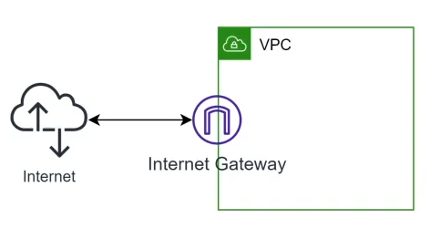

# AWS Overview
AWS (Amazon Web Services) là một nền tản điên toán đám mây phát triển toàn diện được cung cấp bởi Amazon. AWS cung cấp một loạt các dịch vụ điện toán đám mây, bao gồm lưu trữ, máy chủ ảo, cơ sở dữ liệu, phân tích dữ liệu, trí tuệ nhân tạo và nhiều hơn nữa.

## Contents
- [EC2](#ec2)
    + [EC2 thuộc về layer nào?](#ec2-thuộc-về-layer-nào)
    + [Một số khái niệm cơ bản về EC2](#một-số-khái-niệm-cơ-bản-về-ec2)
    + [Giới hạn truy cập tới 1 EC2 Instance](#giới-hạn-truy-cập-tới-1-ec2-instance)
    + [EC2 được sử dụng trong các trường hợp](#ec2-được-sử-dụng-trong-các-trường-hợp)
    + [Elastic Block Storage (EBS)](#elastic-block-storage-ebs)
    + [Single point of failure](#single-point-of-failure)
    + [Elastic Load Balancing](#elastic-load-balancing)
    + [Các thành phần cơ bản của Load Balancer](#các-thành-phần-cơ-bản-của-load-balancer)
    + [Scaling](#scaling)
    + [Auto Scaling Group](#auto-scaling-group)
    + [Các phương pháp scale hệ thống](#các-phương-pháp-scale-hệ-thống)
- [IAM](#iam-identity-and-access-management)
    + [Usecase](#usecase)
    + [IAM Concept](#iam-concept)
    + [IAM - Policy](#iam---policy)
    + [IAM - User](#iam---user)
    + [IAM - Role](#iam---role)
    + [IAM - Group](#iam---group)
    + [IAM - Switch Role](#iam---switch-role)
    + [IAM - Assume Role](#iam---assume-role)
    + [IAM - Trust Policy](#iam---trust-policy)
- [S3](#s3-simple-storage-service)
    + [Đặc trưng cơ bản của S3](#đặc-trưng-cơ-bản-của-s3)
    + [Features](#features)
    + [S3 có thể kết hợp với các dịch vụ nào?](#s3-có-thể-kết-hợp-với-các-dịch-vụ-nào)
    + [S3 Bucket Policy](#s3-bucket-policy)
    + [Access Control List](#access-control-list)
    + [Presign URL](#presign-url)
    + [Versioning](#versioning)
    + [Storage Classes](#storage-classes)
    + [Static Website Hosting](#static-website-hosting)
    + [Event Trigger](#event-trigger)
    + [Best Practices for S3](#best-practices-for-s3)
- [RDS](#rds-relational-database-service)
    + [Đăc trưng cơ bản của RDS](#đăc-trưng-cơ-bản-của-rds)
    + [Features off RDS](#features-off-rds)
    + [RDS support database engines](#rds-support-database-engines)
    + [RDS usecase](#rds-usecase)
    + [Mô hình triển khai RDS](#mô-hình-triển-khai-rds)
    + [Mô hình cluster Aurora](#mô-hình-cluster-aurora)
    + [Mô hình Aurora Global Cluster](#mô-hình-aurora-global-cluster)
    + [Mô hình Serverless của Aurora](#mô-hình-serverless-của-aurora)
    + [Parameter Groups](#parameter-groups)
    + [RDS Proxy](#rds-proxy)
- [VPC](#vpc-virtual-private-cloud)
    

## EC2
EC2 (Amazon Elastic Compute Cloud): Là 1 service cung cấp tài nguyên server ảo theo yêu cầu. Một số đặc trưng:
- Đa dạng cấu hình (Ram/CPU/GPU/Network bw/Ổ cứng)
- Dễ dàng triển khai, nhanh chóng
- Khả năng mở rộng gần như không giới hạn
- Linh hoạt trong việc trả tiền


### EC2 thuộc về layer nào?
- EC2 là một máy chủ ảo chạy trên Hypervisor (trình ảo hoá) của AWS, bên dưới là các phần cứng.
- Về cơ bản người dùng chủ có thể quản lý EC2 từ cấp độ OS trở lên (Windows, Linux,...).
- AWS sẽ không can thiệp vào dữ liệu từ tầng OS trở lên của 1 EC2 instance.
- Về cơ bản của EC2 instance hoạt động như 1 máy chủ độc lập và không thể access nếu như không có quyền.


### Một số khái niệm cơ bản về EC2


- AMI: Amzon Machine Image. Giống như 1 file ISO/Ghost chứa toàn bộ thông tin của hệ điều hành. EC2 đực khởi động lên từ 1 AMI tương tự như việc cài Win lần đầu vào voà máy tính.
- EBS Volume: Ổ cứng ảo được cấp phát bởi Amazon. Chỉ có thể đọc được dữ liệu khi được gắn vào 1 instance.
- Snapshot: Ảnh chụp của 1 EBS Volume tại 1 thời điểm. Có thể sử dụng để phục hồi dữ liệu khi có sự cố.
- Instance: 1 máy chủ ảo được cấp phát tài nguyên CPU, RAM, GPU,... tuỳ theo dòng instance mà sẽ có một số giới hạn nhất định.

### Giới hạn truy cập tới 1 EC2 Instance
Để giới hạn truy cập tới EC2 và từ EC2 ra bên ngoài, AWS cung cấp 1 khái niệm là Security Group.

Notes
- Rule của security group là 2 chiều, request đến sẽ tự nhận được response mà không phải định nghĩa một cách tường minh cho phép đi ra.
- Default nếu không có yêu cầu gì đặc biệt thì Outbound (từ trong di ra) sẽ mở all.
- Rule chỉ có allow không có Deny.
- EC2 có thể gắn nhiều hơn 1 Security Groups.


### EC2 được sử dụng trong các trường hợp
EC2 là 1 dịch vụ rất mạnh mẽ của AWS, xuất hiện trong hầu hết các hệ thống. Ngoài ra EC2 còn là nền tản cơ bản của dịch vụ Container như ECS, EKS(k8s).

Trường hợp cơ bản
- Lift and shift: Migrate 1:1 các ứng dụng đang chạy trên On-premise của cty, không có nhu cầu tái cấu truc.
- Chạy các website cơ bản all in one.
- Computer cluster: dùng cho các ứng dụng chạy xử lý data như Hadoop, Spark,...
- Dừng làm database trong trường hợp không muốn xài dịch vụ database sẵn của AWS.
- Dừng làm cluster k8s trong trường hợp muốn tự dựng.

### Elastic Block Storage (EBS)
Đặc trưng
- Là một cơ chế lưu trữ dạng block.
- Đơn vị quản lý là các EBS Volume.
- Chỉ có thể access data khi được gắn vào một EC2 instance (dùng làm ổ root, C, hoặc ổ data).
- Một số loại EBS đặc biệt cho phép gắn vào nhiều hơn 1 EC2 instance (multi attach).
- Có thể tăng size một cách dê dàng ngay cả khi server đang chạy (không thể giảm size).

### Single point of failure
Single point of failure: Khi một sự cố xảy ra ở một thành phần nào đó có thể dẫn đến hệ thống bị dừng hoạt động, không thể phục vụ người dùng.

Example:
- Một chương trình bị lỗi và crash.
- Database bị sập không respone
- Hệ điều hành bị treo
- Một trong các phần cứng vật lý bị hỏng.
- Bộ cung cấp nguồn cho cả Server Rack bị sự cố.
- Xảy ra sự cố cúp điện cả data center, bị bão lụt, bão, đánh bom, thiên thạch ...

=> Cần nhiều hơn 1 thành phần cho mỗi layer của hệ thống để tránh "single point of failure".


Note: Trong kiến trúc single point of failure như hình bên, bất kỳ sự cố hỏng ở 1 trong các cấp độ App, OS, Hypervisor cho tới hardware đều có thể ảnh hưởng tới tính khả dụng của hệ thống.

### Elastic Load Balancing
Một dịch vụ của AWS có nhiệm vụ điều hướng request từ client đến các target backend, đảm bảo request được cân bằng giữa các target.
ELB là 1 dịch vụ managed hoàn toàn bởi AWS, dễ dàng setup, có đầy đủ các đặc tính cần thiết như:
- High Availability
- Scalability: gần như không giới hạn
- High Security: Nếu kết hợp các dịch vụ khác như WAF, Security Group.
ELB có thể dễ dàng kết hợp với đa dạng backend sử dụng EC2, Container, Lambda.

### Các thành phần cơ bản của Load Balancer


- Load Balancer cho phép setting các listener (trên 1 port nào đó vd HTTP:80, HTTPS:443)
- Mỗi Listener cho phép cấu hình nhiều rule.
- Request sau khi đi vào listener, được đánh giá bởi các rule sẽ được forward tới target group phù hợp.
- Target group có nhiệm vụ health check để phát hiện và loại bỏ target un-healthy.

### Scaling
Là việc điều chỉnh cấu hình của các tài nguyên để đáp ứng với nhu cầu workload (số request từ người dùng, số lượng công việc phải xử lý,..). Có hai hình thức scale:
- Scale Up/Down: Tăng/Giảm cấu hình của resources (ex: tăng CPU/RAM cho Server, database, tăng dung lượng ổ cứng,...).
- Scale Out/In: Tăng/Giảm số lượng thành phần trong cụm chức năng. (ex: add thêm server vào cluster application, add thêm node vào k8s cluster,...).


Scale Up/Down


Scale Out/In

### Auto Scaling Group
Có nhiệm vụ điều chỉnh số lượng của instance cho phù hợp với workload. Mục đích:
- Tiết kiệm chi phí
- Tự động hoá việc mở rộng và phục hồi sự cố.

ASG sử dụng Launch Template để biết được cần phải launch EC2 như thế nào. Để thực hiện được việc scale, Auto Scaling Group phải kết hợp với việc monitor các thông số của các thành phần trong hệ thống để biết được khi nào cần scale-out, khi nào cần scale-in
=> Sự cần thiết của CloudWatch.


### Các phương pháp scale hệ thống
Có các option sau để scale một Auto Scaling Group
- No Scale: Duy trì 1 số lượng cố định instances (nếu instance die thì tạo con mới để bổ sung, ngoài ra không làm gì cả)
- Manual Scaling: Điều chỉnh 3 thông số min/max/desire để quyết định số lượng instance trong ASG.
- Dynamic Scaling: Scale tự động dựa trên việc monitor các thông số:
    + Target tracking scaling: Monitor thông số ngay trên chính cluster (ex: CPU, Memory, Network in-out).
    + Step scaling: Điều chỉnh số lượng instance (tăng/giảm) dựa trên 1 tập hợp các alarm (có thể đến từ các resource khác không phải bản thân cluster).
    + Simple scaling: Tương tự Step scaling tuy nhiên có apply "cool down period".
- Schedule Scaling: Đặt lịch để tự động tăng giảm số instance theo thời gian, phù hợp với các hệ thống có workload tăng vào 1 thời điểm cố định trong ngày.
- Predict Scaling: AWS đưa ra dự đoán dựa vào việc học từ thông số hằng ngày, hằng tuần để điều chỉnh số lượng instance 1 cách tự động. Độ chính xác phụ thuộc vào thời gian application đã vận hành và tính ổn định của traffic đi vào hệ thống.


Ví dụ trên, trường hợp scale sử dụng metrics đến từ bên ngoài cluster:
- Hình trên mô tả 1 server cluster có nhiệm vụ xử lý video encoding.
- Danh sách video được lấy từ SQC (dịch vụ msg queue).
- Msg producer có nhiệm vụ đăng ký video cần xử lý vào queue.
- Nếu số lượng msg trên queue quá nhiều hoặc mssg được ghi vào queue nhưng qua lâu không được xử lý xong, ta có thể monitor queue để ra quyết định có scale-out (add instance vào server cluster) hay không.


## IAM (Identity and Access Management)
IAM có nhiệm vụ định danh và phân quyền, quản lý việ ai và cái gì có thể access như thế nào tới các resources trên AWS, quản lý một cách tập trung các quyền chi tiết, phân tích truy cập để tinh chỉnh quyền.


### Usecase
- Áp dụng quyền chi tiết và mở rộng quy mô với khả năng kiểm soát truy cập dựa trên thuộc tính. (ex: phòng ban, job role, tên nhóm).
- Quản lý truy cập theo từng tài khoản hoặc mở rộng quy mô truy cập trên các tài khoản và ứng dụng AWS.
- Thiết lập quy tắc bảo vệ và phòng ngừa cho toàn tổ chức.
- Thiết lập, xác định và điều khiển quy mô quyền đối với đặc quyền tối thiểu thông qua việc thiết lập, xác minh, tuỳ chỉnh.

### IAM Concept
Để có thể thiết kế và xây dựng hệ thống trên AWS đảm bảo tiêu chí về Security cũng như không gặp trouble, chúng ta cần nắm vững các concept cơ bản IAM:
- User
- Group
- Role
- Permission


### IAM - Policy
Quy định việc ai/cái gì có thể hoặc không thể làm gì. Một policy thường bao gồm nhiều Statement quy định Allow/Deny hành động trên resource dựa trên condition. Mỗi statement cần định nghĩa các thông tin:
- Effect: có 2 loại là Allow & Deny (Deny được ưu tiên hơn).
- Action: tập hợp các action cho phép thực thi.
- Resource: tập hợp các resource cho phép tương tác.
- Condition: điều kiện kèm theo để apply statement này.

Policy có thể gắn vào Role/Group/User.

Policy có hai loại:
- Inline Policy: được đính trực tiếp lên Role/User/Group và không thể tái sử dụng ở Role/User/Group khác.
- Managed Policy: được tạo riêng và có thể tái sử dụng trên nhiều Role/User/Group khác. Managed Policy được chia làm hai loại AWS Managed và User Managed.

=> Việc lựa chọn giữa Inline and Managed phải được tính toán dựa trên các yếu tố như: tính tái sử dụng, quản lý thay đổi tập trung, versioning & rollback.

### IAM - User
Đại diện cho 1 profile của 1 người dùng trên AWS account. User có thể login vào AWS Console sử dụng username/password. User mặc định khi tạo ra sẽ không có quyền gì. Cần cấp quyền cho user thông qua Policy hoặc Group. User có thể phát hành access-key/secret-key để sử dụng cho CLI hoặc test SDK trong quá trình test code. Cặp access/secret key này cũng sẽ đại diện cho user (thay vì dùng username/password).

### IAM - Role
Đại diện cho 1 quyền trên AWS. Không giống với khái niệm Role của 1 user như trong phân quyền hệ thống, cần lưu ý để tránh nhầm lẫn. Sử dụng khi cấp quyền cho 1 thực thể có thể tương tác với các resources khác trên AWS. Thường dùng để gắn vào EC2, Lambda, Container,.. Có thế sử dụng để cấp quyền cho 1 user nằm ở AWS account khác mà không muốn tạo ra user profile cho họ trên AWS của mình. Bằng cách cho phép 1 user assume-role tới 1 role trên account, user có thể có các quyền tạm thời để thực hiện thao tác.

`Note:` Một resource trên AWS không thể tương tác với resource khác nếu không được gán Role với các quyền thích hợp. Đây cũng chính là lý do khiến cho việc Role & Permission khiến cho mọi người tốn thời gian troubleshoot nếu không nắm rõ dịch vụ mà mình đang sử dụng.

### IAM - Group
Đại diện cho 1 nhóm user trên hệ thống. Sử dụng khi phân quyền dựa theo vai trò trong dự án, phòng ban,.. Nên thiết kế các nhóm user và phân quyền hợp lý, sau đó khi có người mới chúng ta chỉ cần add user đó vào các nhóm cần thiết giúp tiết kiệm thời gian và tránh sai sót (cấp dư hoặc thiếu quyền). Lưu ý tránh bị chồng chéo quyền (ex: 1 group allow action A nhưng group khác lại deny action A). Một group không thể chứa group khác (lồng nhau). Một user có thể không thuộc group nào hoặc thuộc nhiều groups. Một group có thể không có user nào hoặc có nhiều users.

### IAM - Switch Role
Khi muốn cấp quyền access cho user X vào account B nhưng không muốn tạo profile, ta có thể cho phép user X switch role sang role Y của account B từ đó có thể thực hiện các thao tác trên account B. Sau khi switch role, user sẽ rời bỏ quyền ban đầu của mình và sẽ tương tác với các resource khác với tư cách là role Y. Để switch role được, role Y phải thiết lập trust policy trước đó cho phép user X có thể switch role.


### IAM - Assume Role
Yêu cầu AWS STS cung cấp 1 set temporary security credential để có thể access resource mà thông thường ta không có quyền access. Có thể assume tới 1 role trên cùng 1 account hoặc khác account. Sử dụng trong các usecase cấp quyền tạm thời mà không muốn tạo nhiều user, quản lý tập trung user thông qua Single-Sign-On thay vì tạo user trên từng account.


### IAM - Trust Policy
Quy định đối tượng nào có thể assume sang role được gắn trust policy này. Đối tượng được trust có thể là User/Role/AWS service.

`Note:` Trong rất nhiều trường hợp các dịch vụ của AWS cần được setting trust policy một cách tường minh để có thể assume sang role của nhau.


## S3 (Simple Storage Service)
Là dịch vụ lưu trữ dạng Object cung cấp khả năng mở rộng, availability, performance. Client có thể sử dụng S3 để lưu trữ và bảo vệ nhiều loại data cho các usecase như: data lake, website, mobile, backup & restore, archive, enterprise application, Iot device, Big data & Analytics. S3 cung cấp nhiều managed feature giúp tối ưu, tổ chức và cấu hình access tới data đáp ứng nhu cầu về business, organization, compliance.

### Đặc trưng cơ bản của S3
- Là một Managed Service. User không cần quan tâm tới hạ tầng ở bên dưới.
- Cho phép lưu file dưới dạng object với size từ 0 - 5TB.
- High Durability (11 9's), Scalability, High Availability (99.99%), High Performance.
- Usecase đa dạng (mọi bài toán về lưu trữ từ lớn đến nhỏ đều sử dụng S3).
- Cung cấp nhiều class lư trữ để tiết kiệm chi phí cho từng loại data.
- Cung cấp khả năng phân quyền và giới hạn truy cập một cách chi tiết.
- Dễ sử dụng, có thể kết hợp nhiều services khác cho bài toán automation và data processing.

### Features
- Storage Class: cung cấp nhiều hình thức lưu trữ phù hợp cho nhiều loại data khác nhau về nhu cầu access, yêu cầu về durability, thời gian lưu trữ khác nhau giúp khác hàng tuỳ chọn được class lưu trữ phù hợp từ đó tối ưu chi phí.
- Storage Management: cung cấp nhiều tính năng liên quan quản lý như: Life Cycle, Object Lock, Replication, Batch Operation.
- Access Management: quản lý truy cập đến bucket và các thư mục thông qua cơ chế resource permission and access list. Block public access, control access via IAM, bucket policy, S3 access point, Access Control List, Ownership, Access Analyzer.
- Data Processing: kết hợp với lambda, SNS, SQS để hỗ trợ xử lý data 1 cách nhanh chóng.
- Auto Logging and Monitoring: cung cấp công cụ monitor S3 bucket và truy vết sử dụng CloudTrail.
- Manual Monitoring Tool: log lại từng record thực hiện trên bucket.
- Analytic and insight: phân thích storage để optimize.
- Strong consistency: Provide strong read-after-write consistency for PUT and DELETE object.

### S3 có thể kết hợp với các dịch vụ nào?

- Dùng làm nơi lưu trữ file cho các ứng dụng chạy trên EC2, Container, Lambda. Các file có thể đa dạng về loại và kích thước (img, video, doc,..)
- Dùng làm nơi chứa/archive log cho hầu hết các dịch vụ khác của AWS (VPC, ALB, APIGateway,..).
- Dừng làm data source cho các bài toán big data and data warehouse.
- Nơi lưu dữ liệu gửi lên từ các thiết bị IoT.
- Vùng lưu trữ tạm thời cho bài toán ETL (Extract, Transform, Load) khi kết hợp với lambda.
- Host 1 website tĩnh (html, css, js) khí kết hợp với CloudFront


`Note:` Đây là những ví dụ kết hợp nổi bật thường được sử dụng.

### S3 Bucket Policy
- S3 là một trong số các resource hỗ trợ Resource Level Policy để giới hạn quyền truy cập bên cạnh IAM Policy.
- Bản chất S3 bucket policy hoạt động như 1 IAM Policy nhưng chỉ trong phạm vi bucket và những resource bên trong nó (folder/file).
- S3 bucket policy sẽ cho phép hoặc chặn truy cập tới bucket hoặc các resource bên trong.
- Áp dụng cho những bucket yêu cầu security cao, cần được setting giới hạn truy cập một cách chặt chẽ.

### Access Control List
- Access Control List: quy định quyền access của một AWS account hoặc nhóm user(Group) đến bucket hoặc resource bên trong.
- Thường dùng trong trường hợp muốn cấp access cho một resource cụ thể bên trong bucket mà không muốn thay đổi bucket policy.
- Gần đây AWS khuyến nghị người dùng không dùng ACL trừ khi có yêu cầu đặc biệt, thay vào đó hay sử dụng bucket policy, iam policy, pre-sign URL là đủ để cover hầu hết các usecase.

### Presign URL
- Khi muốn cấp access tạm thời cho người dùng public tới một obj trên S3, AWS cung cấp cơ chế Presign URL.
- User có thể dùng Presign URL để download/upload obj trên S3 trong thời gian quy định.
- Usecase: 
    + Muốn cấp access public cho 1 obj nhưng không muốn thay đổi ACL hoặc tạo thêm bucket policy.
    + Cần authentication người dùng hoặc yêu cầu họ lam gì đó trước khi được download file
    + Ngăn chặn resource để public vô thời hạn khiến cho tài nguyên bị khai thác bởi bên khác.


Flow for Presign URL (download/upload)


### Versioning
- Sử dụng khi có nhu cầu lưu trữ nhiều version của cùng 1 obj.
- Tránh được việc mất mát khi thao tác xoá nhầm hoặc ghi đè (có thể lấy lại version trước đó).
- Chi phí theo đó sẽ tăng lên so với khi không bật versioning.
- Sau khi bật versioning, nếu tắt versioning thì những obj trước khi tắt vẫn sẽ có nhiều version, những obj sinh ra sau khi tắt sẽ không có version.

### Storage Classes
Cung cấp nhiều storage khác nhau nhằm giúp khác nhau nhằm giúp người dùng linh động trong việc lựa chọn class phù hợp với nhu cầu, tiết kiệm chi phí.

Việc lựa chọn class phụ thuộc vào các yêu tố như:
- Durability, High Availability
- Thời gian lưu trữ (1 tháng, 3 tháng, 1 năm, vô thời hạn,...)
- Tần suất truy cập, thời gian cần có file khi có yêu cầu
- Mục đích sử dụng: document, image, log file, backup file, archive.

Các storage class phổ biến:
- S3 Standard: Loại mặc định khi tạo obj mà không chỉ định classes. Phù hợp cho hầu hết các usecase.
- S3 intelligent Tiering: Monitor tần suất access của các obj 1 cách tự động để move xuống các class rẻ tiền hơn giúp tiết kiệm chi phí. Chỉ apply cho obj >= 128KB. Customer phải chịu thêm phí monitor.
- S3 Standard Infrequently Access: Phù hợp cho các data ít khi được access nhưng khi request cần có ngay. Availability 99.9% (nhỏ hơn standard 99.99%).
- S3 Oner-zone Infrequently Access: Rẻ hơn standard IA 20% do chỉ lưu trữ trên 1 AZ. Phù hợp cho các data có thể dễ dàng tạo ra nếu không may bị mất (report, file image resized). Availability 99.5%.
- S3 Glacier: Phù hợp cho việc lưu trữ những data có yêu cầu thời gian lưu trữ lên tới vài năm nhưng ít khi được sử dụng. Tuỳ theo nhu cầu khi access mà Glacier lại chia ra 1 số sub class:
    + Glacier Instant Retrieval: Rẻ hơn tới 68% so với S3 Standard IA. Cho phép access 1 file với thời gian ngắn khi có nhu cầu. (ex: hồ sơ phim chụp của bệnh nhân ở bệnh viện rất ít khi cần lục lại nhưng muốn xem phải có ngay).
    + Glacier Flexible Retrieval: Phù hợp cho data không yêu cầu access ngay hoặc chưa rõ, thời gian cần để access file có thể từ vài phút đến vài giờ. Phù hợp cho việc data backup hoặc archive.
    + Glacier Deep Archive: Phù hợp cho việc lưu trữ lâu dài tới 7-10 năm tuỳ theo tiêu chuẩn ngành như tài chính, y tế,.. Data được lưu trên các băng đĩa từ (magnetic tap). AWS cam kết có thể access data trong vòng 12h khi cần.
- S3 on Outposts: Cho phép sử dụng S3 ở on-premise

### Static Website Hosting
- S3 có hỗ trợ người dùng host 1 website tĩnh (chỉ bao gồm html, css, js, image..)
- Được thừa hưởng toàn bộ đặc tính của S3 (Durability, HA)
- Không cần duy trì server, giảm effort Administration.
- Hỗ trợ setting CORS nhằm bảo vệ tài nguyên bị khai thác bởi website khác.
- Kết hợp với dịch vụ CDN (CloudFront) có thể giúp tăng tốc độ truy cập khi user nằm ở các region khác nhau.

### Event Trigger
- S3 cung cấp cơ chế trigger 1 event sang dịch vụ khác khi có thể thay đổi đối với obj (upload, delete)
- Target của trigger có thể là Lambda Function, SNS, SQS.s
- Usecase:
    + Resize img khi có người upload img lên S3 bucket, lưu vào các thư mục size khác nhau
    + Giải nén 1 file zip khi có người upload
    + Extract csv file, xử lý data rồi lưu vào db
    + Notification với Operator khi có một ai xoá 1 file

### Best Practices for S3
- Chọn region của S3 cùng region với application (EC2, ECS) để tối ưu performance.
- Use bucket policy cho những data quan trọng. Cấp quyền vừa đủ cho user/role, hạn chế cấp S3FullAccess.
- Bật versioning để bảo vệ data tránh bị mất, xoá nhầm.
- Mã hoá data nhạy cảm (client side or server side).
- Enforce TLS để yêu cầu sd HTTPS khi truyền nhận file (chống hack).
- Sử dụng VPC endpoint để tăng tốc truy cập từ application 
- Khi host static web, nên kết hợp với CloudFront để tối ưu chi phí và tăng trải nghiệm người dùng.


## RDS (Relational Database Service)
RDS (Relational Database Service) là 1 service giúp người dùng tạo và quản lý các Relational Database.

### Đăc trưng cơ bản của RDS
- Là 1 Database as a Service. User không cần quan tâm tới hạ tầng ở bên dưới.
- Cho phép người dùng tạo ra các database instance độc lập hoặc cụm instance hoạt động dưới mode cluster.
- Không thể login vào instance level (khác với việc cài DB lên 1 EC2 instance).
- Có thể scale theo 2 hình thức:
    + Scale virtical: tăng hoặc giảm cấu hình instance.
    + Scale horizontal: Thêm hoặc bớt node tuy nhiên node này chỉ có thể read (read-replica).
- Có giới hạn về dung lượng ổ cứng tối đa (64TB đối với MySQL, Maria,.. 16TB đối với Microsoft SQL).

### Features off RDS
- Cho phép tạo các DB instance hoặc cụm cluster 1 cách nhanh chóng.
- Tự động fail-over giữa master-slave instance khi có sự cố.
- High-Availability: tự động cấu hình instance stand by, người dùng chỉ cần chọn.
- Tự động scale dung lượng lưu trữ.
- Liên kết với CloudWatch để giám sát dễ dàng.
- Automate backup & manage rêtntion.
- Dễ dàng chỉnh sửa setting ở cấp độ DB sử dụng param group.

### RDS support database engines
- Amazon Aurora
- MySQL
- MariaDB
- PostgreSQL
- Oracle
- Microsoft SQL Server

### RDS usecase
- RDS được sử dụng trong hầu hết các trường hợp cần DB dạng quan hệ (ex: lưu trữ thông tin của user, website e-commerce, education,..)
- RDS thích hợp cho các bài toán OLAP (Online Analytical Processing) nhờ khả năng truy vấn mạnh mẽ, cấu hình có thể scale theo yêu cầu.

### Mô hình triển khai RDS
RDS có thể triển khai theo một số mô hình sau:
- Single instance
- Single instance with Multi-AZ option = yes
- Master - Read Only cluster
- Master - Read Only cluster with Multi-AZ option = yes
- Master - Multi Read cluster

#### Single Instance
Chỉ có 1 DB instance duy nhất được tạo trên Availability Zone (AZ). Nếu có sự cố xảy ra ở cấp độ AZ, DB không thể truy cập. Phù hợp cho môi trường Dev-Test để tiết kiệm chi phí.


#### Single instance with Multi-AZ option enabled
Một bản sao của instance sẽ được tạo ra ở AZ khác và hoạt động dưới mode standby. Nhiệm vụ của instance standby này là sync data từ master, không thể truy cập instance này.


Khi có sự cố, instance standby sẽ được chuyển lên thành master (việc này được AWS thực hiện tự động, endpoint url được giữ nguyên). Nếu enable multi AZ, số tiền bỏ ra x2. Phù hợp cho DB Production.


#### Master - Read Only cluster
1 instance với mode ReadOnly sẽ được tạo ra và liên tục replica data từ master instance. Instance này chỉ có thể đọc data. Phù hợp cho hệ thống có workload read > write, muốn tối ưu performance của DB. Sau khi thiết lập quan hệ, instance được tạo ra sẽ kết hợp thành 1 cluster.


Trong trạng thái 2 instance đã hình thành cluster, nếu Master instance gặp sự cố, failover sẽ được tự động thực hiện, ReadOnly instance được promote lên làm Master.

`Note:` endpoint của 2 instance sẽ riêng biệt nên sau khi failover, cần chỉnh lại connection từ App


#### Master - Read Only cluster with Multi-AZ option enabled
Tương tự mô hình Master - Read Only tuy nhiên các node đều được bật Multi-AZ enabled. Chi phí sẽ gấp 4 lần mô hình Single Instance.


#### Master - Multi Read cluster
Mô hình này, nhiều hơn 1 reader instance sẽ được tạo ra.


`Example mô hình triển khai RDS`


### Aurora
- Aurora là công nghệ database độc quyền của AWS, hỗ trợ 2 loại engine là MySQL và PostgreSQL.
- Aurora có 2 hình thức triển khai:
    + Cluster (Master + Multi Read Replica)
    + Serverless
- Những tính năng vượt trội của Aurora so với RDS thông thường 
    + Hiệu năng tốt hơn 
    + Hỗ trợ backtracking (tính nẵng cho phép revert DB về trạng thái trong khá khứ tối đa 72h. Khác với restore từ snapshot đòi hỏi tạo instance mới, backtracking restore ngay trên chính cluster đang chạy)
    + Tự động quản lý Write endpoint, Read endpoint ở cấp độ cluster.

### Mô hình cluster Aurora
Cluster Aurora bao gồm: 
- 1 Master node (Primary instance)'
- 1 hoặc nhiều Replica node (max 15)

Data của Aurora cluster được lưu trên 1 storage layer gọi là Cluster Volume span trên nhiều AZ để tăng HA. 

Data được Cluster Volume tự động replicate trên nhiều AZ. Số lượng copy không phụ thuộc vào số lượng instance của cluster.

Cluster Volume tự động tăng size dựa vào nhu cầu của người dùng (không thể fix cứng size)


### Mô hình Aurora Global Cluster
Là 1 cơ chế cho phép tạo ra cụm cluster cross trên nhiều regions
- Tăng tốc độ read tại mỗi region tương đương với local read.
- Mở rộng khả năng scale số lượng node read (limit 15 read nodes cho cluster).
- Failover, Disaster recovery: rút ngắn RTO và giảm thiểu RPO khi xảy ra sự cố ở cấp độ region.

Mặc định cluster ở region thứ 2 trở đi có thể read, tuy nhiên có thể enable write forwarding để điều hướng request tới primary cluster.


`Note:` Khác với RDS thông thường, Aurora sử dụng tầng Storage để replicate data giữa master-read nodes

### Mô hình Serverless của Aurora
- Aurora Serverless là 1 công nghệ cho phép tạo DB dưới dạng serverless
- Thay vì điều chỉnh cấu hình của DB istance, người dùng sẽ điều chỉnh ACU (Aurora Capacity Unit), ACU càng cao hiệu suất DB càng mạnh.
- Phù hợp cho các hệ thống chưa biết rõ workload, hoặc workload có đặc trưng thay đổi lên xuống thường xuyên.

### Parameter Groups
- RDS là một managed service do đó không thể login vào instance. Nếu muốn can thiệp vào setting ở cấp độ DB (Không phải OS) ta cần thông qua 1 cơ chế gián tiếp là parameter groups.
- Khi tạo RDS nếu không chỉ định gì AWS sẽ sử dụng Param Group Default của hệ DB đang chọn. Param Group default không thể chỉnh được.
- Custom Parameter Group được tạo ra bằng cách copy default Parameter Group sau đó chỉnh sửa những tham số phù hợp với nhu cầu.
- Param Groups có 2 loại là Cluster GGroups và Instance Param Groups.

Một số Param thường được custom riêng theo nhu cầu hệ thống


### RDS Proxy
- RDS cung cấp cơ chế proxy giúp quản lý connection tới các instance 1 cách hiệu quả, hạn chế bottle neck (ex: do application quản lý connection không tốt gây ra).
- Khi sử dụng proxy, application sẽ không kết nối trực tiếp tới RDS mà không qua proxy endpoint.
Chi phí sẽ phát sinh thêm cho proxy.
- hiện tại hỗ engine: MySQL, PostgreSQL, SQL Server.


## VPC (Virtual Private Cloud)
Là 1 service cho phép người dùng tạo 1 mạng ảo (virtual network) và control toàn bộ network in/out của mạng đó. VPC tương đối giống với network ở data center truyền thống tuy nhiên các khái niệm đã được AWS đơn giản hoá giúp người dùng dễ tiếp cận.

### Các thành phần cơ bản của VPC
- VPC: Một mạng ảo được tạo ra ở cấp độ region.
- Subnet: 1 dải IP được định nghĩa nằm trong VPC. Mỗi subnet phải được quyết định Zone tại thời điểm tạo.
- IP Address: IP V4 hoặc V6 được cấp. Có 2 loại là Public IP và Private IP.
- Routing: Xác định traffic sẽ được điều hướng đi đâu trong mạng.
- Security Group: Đóng vai trò như 1 firewall ở cấp độ instance, định nghĩa trafic được đi vào hay đi ra. 
- Network Access Controll List: Được apply ở cấp độ subnet, tương tự như sercurity group nhưng có rule Deny và các rule được đnahs ưu tiên. Mặc định khi tạo VPC sẽ có 1 ACL được apply cho toàn bộ subnet trong VPC (mở all traffic không chặn gì cả).
- VPC FLow Log: Captủe các thông tin di chuyển của traffic trong network.
- VPN Connection: Kết nối VPC trên AWS với hệ thống dưới On-premise.
- Elastic Network Interface: Đóng vai trò như 1 card mạng ảo.
- Internet Gateway: Kết nối VPC với Internet, là cổng vào tới internet tới các thành phần trong VPC.
- NAT Gateway: Dịch vụ NAT của ĂS cho phép các thành phần bên trong kết nối tới internet nhưng không cho bên ngoài kết nối tới.
- VPC Endpoint: Kênh kết nối private giúp kết nối tới các services khác của AWS mà không thông qua internet.
- Peering Connection: Kênh kết nối giữa 2 VPC.
- Transit Gateways: Đóng vai trò như 1 hub đứng giữa các VPCs, VPN Connection, Direct Connect.

### Sample VPC với các thành phần cơ bản


### Làm sao định nghĩa một VPC?
VPC được định nghĩa bằng 1 dãi CIDR.
AWS cho recommend chọn 1 trong 3 dải CIDR (theo chuẩn RFC-1918):
- 192.168.0.0 - 192.168.255.255 (ex: 192.168.0.0/20)
- 10.0.0.0 - 10.255.255.255 (ex: 10.0.0.0/16)
- 172.16.0.0 - 172.31.255.255 (ex: 172.31.0.0/16)

Việc định nghĩa CIDR của IP cần tuân thủ một số tiêu chí:
- Cover được số lượng IP private cần cấp phát trong tương lai.
- Tránh overlap với các hệ thống sẵn có (kể cả on-premise) nếu không sẽ không thể peering.

### Phân chia subnet như thế nào?
Subnet được coi như 1 thành phần con của VPC. Một VPC có thể chứa nhiều subnet không overlap nhau. Khi tạo subnet phải chọn Availability Zone

`Note: Chọn CIDR cho subnet cần lưu ý:`
- Số lượng IP cho các resource cần cấp phát (EC2, Container, Lambda,..) (ex: bạn tạo 1 subnet 10.0.1.0/24 sẽ chứa được 256 IP trừ đi 5 reserve ip của AWS => 251 IP khả dụng).
- Số lượng subnet dự tính sẽ tạo trong tương lai.
- Đặt số sao cho dễ quản lý.

Example: 
```
- Một dải ip có 10.0.0.0/16 sẽ có thể chứa tổng cộng 65536 IPs. 2**(32-16) = 65536
- Một dải ip có 10.0.0.0/22 sẽ có thể chứa tổng cộng 1024 IPs. 2**(32-22) = 1024
=> Số lượng subnet của 1 VPC = Tổng IP / Số IP của mỗi Subnet = 65536/1024 = 64 subnets
```

Giả sử VPC sử dụng CIDR /16 và Subnet sử dụng CIDR /22 tá sẽ có sơ đồ sau.


### Các thành phần VPC detail
#### Internet Gateway
Là cửa ngõ để truy cập các thành phần trong VPC. Nếu VPC không được gắn Internet Gateway thì không thể kết nối SSH tới instance kể cả instance đó có được gắn public IP. Mặc định default-vpc do AWS tạo sẵn đã có gắn Internet Gateway.



#### NAT Gateway
Giúp cho các instance trong Private Subnet có thể đi ra internet mà không cần tới public IP. Giúp tăng cường bảo mật cho các resource cần private (App, DB)


#### VPC Endpoint
Giúp các resource trong VPC có thể kết nối tới các dịch vụ khác của AWS thông qua private connection. Công dụng: secure, tăng tốc độ. Có hai loại endpoint là Gateway Endpoint (S3, DynamoDB) và Interface Endpoint (SQS, CloudWatch,..). Endpoint có thể được cấu hình Security Group để hạn chế truy cập.


#### Network Access Control List (ACL)
Control network in/out đối với subnet được associate. Mỗi rule sẽ có các thông số:
- Priority
- Allow/Deny
- Protocol
- Port range
- Source IP/ Destination IP

Default ACL sẽ allow all. Sử dụng quá nhiều rule của ACL sẽ làm giảm performance. Rule của ACL là stateless


#### Security Group
Thường được dùng để gom nhóm các resource có chung network setting (in/out, protocol, port). Khi thiết kế cần quan tâm tới tính tái sử dụng, dễ quản lý. Source của 1 Security Group có thể là id của 1 Security Group khác. Rule của Security Group là stateless và không có deny rule


#### Route Table 
- Định tuyến traffic trong subnet hoặc gateway sẽ được điều hướng đi đâu.
- Route Table sẽ quyết định 1 subnet sẽ là Private hay Public.
- Một Subnet chỉ có thể associate 1 route table
- Default VPC do AWS tạo sẵn sẽ có 1 main route table associate với toàn bộ subnet. 


## DynamoDB
### NoSQL là gì?
Non-Relational Database, còn được gọi là NoSQL là 1 hệ thống cơ sở dữ liệu mà không sử dụng mô hình quan hệ truyền thống dưới dạng các bảng và các quan hệ khóa ngoại. Thay vào đó, nó sử dụng 1 cấu trúc dữ liệu khác, phù hợp hơn với các ứng dụng có khối lượng dữ liệu lớn, tốc độ truy vấn nhanh và tính mở rộng cao hơn.

### Một số mô hình NoSQL
- Key-value: Lưu trữ dữ liệu dưới dạng các cặp key-value. Các khóa được sử dụng để truy cập và lấy dữ liệu, trong khi giá trị có thể là bất kỳ dữ liệu nào.
- Document: Lưu trữ dữ liệu dưới dạng tài liệu, thường là định dạng JSON hoặc XML. Các tài liệu được lưu trữ theo dạng phi cấu trúc, cho phép dữ liệu được lưu trữ 1 cách linh hoạt và thêm vào dễ dàng.
- Column oriented: Lưu trữ dữ liệu dưới dạng các bảng với hàng và cột, nhưng khác với cơ sở dữ liệu quan hệ, các cột có thể được thêm và loại bỏ 1 cách độc lập.
- Graph: Lưu trữ dữ liệu dưới dạng các nút và mối quan hệ giữa chúng, cung cấp khả năng xử lý dữ liệu phức tạp.

### DynamoDB là gì?
Amazon DynamoDB is a fully managed, serverless, key-value NoSQL DB designed to run high-performance applications at any scale. DynamoDB offers built-in security, continuous backups, automated multi-region replication, in-memory caching, and data import and export tool.

### Đặc trưng cửa DynamoDB
- Serverless: Hạ tầng được quản lý bởi AWS. User tương tác với DynamoDB thông qua console, CLI, các tool client hoặc software SDK.
- Data được tổ chức thành các đơn vị table
- Độ trễ thấp (single digit milisecond)
- SLA: 99.999% availability
- Automatic Scale Up/Down tùy theo workload (WCU, RCU)
- Kết hợp được nhiều service khác của AWS

`Ưu điểm:`
- Serverless nên chi phí vận hành thấp, tính khả dụng cao.
- Linh hoạt trong cấu hình (zero idle cost, phù hợp cho startup)
- Khả năng scale không giới hạn (về lý thuyết), độ trễ thấp, hiệu suất cao.
- Strongly consistency
- Hỗ trợ mã hóa

`Nhược điểm:`
- Không phù hợp với data query và analytic
- Thiếu tính năng khi so sánh với SQL

### DynamoDB usecases
- Software application: Hầu hết các software có nhu cầu về high concurrent cho hàng triệu user đều có thể cân nhắc sử dụng DynamoDB (ex: e-commerce)
- Media metadata store: Lưu trữ metadata cho các media.
- Gaming platform
- Social media: Mạng xã hội, bài đăng, bình luận
- Logistic system
- Ứng dụng IoT

### DynamoDB Concepts - Data type
- Table: đơn vị quản lý cao nhất của DynamoDB. Table không thể trùng tên trên 1 region.
- Primary key: thông tin bắt buộc khi tạo table, primary key chia làm 2 loại
    + Simple Primary key: chỉ bao gồm Partition key
    + Composite Primary key: bao gồm Partition key and Sort key
- Global Secondary index (optional): bao gồm 1 cặp partition key and sort key tùy ý
- Local Second index (optional): bao gồm 1 cặp partition key giống với partition key của table và sort key tùy ý.
- Query: thực hiện truy vấn data trên 1 index
- Scan: tìm toàn bộ giá trị thỏa mãn điều kiện.
- PartiQL: SQL-compatible query language cho phép access data quan hệ, bán cấu trúc hoặc cấu trúc lồng nhau.

DymanoDB hỗ trợ các loại data type sau:
- String
- Number
- Binary
- Bool
- Null
- Set
- Map
- List

### DynamoDB Concepts - Indexing
DynamoDB hỗ trợ 2 loại index là Global Secondary Index và Local Secondary Index
- Local Secondary Index: loại index phụ thuộc vào table và sử dụng partition key của table để xác định ví trí index. LSI giới hạn số lượng index của mỗi table là 5 và chỉ có thể tạo lúc tạo table. Các Attribute của LSI phải nằm trong bảng gốc.
- Global Sencondary Index: 1 loại index độc lập với table và có thể xác định các attribute khác ngoài partition key để tìm kiếm nhanh dữ liệu. Với GSI, bạn có thể tạo ra các index mới mà không cần phải thay đổi cấu trúc của table gốc. DynamoDB hỗ trợ tối đa 20 GSI trên mỗi table.

Khi tạo index, ta có thể setting attribute projection như sau:
- Project all: Secondary index sẽ bao gồm luôn các attribute của bảng chính
- Project key only: Secondary index chỉ bao gồm thông tin primary key.
- Project selected attribute: chỉ những attributes được chỉ định sẽ bao gồm trong index

### DynamoDB Global Table
DynamoDB Global table là 1 tính năng của Amazon DynamoDB, cho phép bạn sao chép và đồng bộ dữ liệu giữa các khu vực khác nhau trên toàn cầu. Nó cho phép bạn tạo các bảng DynamoDB trên nhiều khu vực và tự động sao chép dữ liệu giữa chúng để đảm bảo dữ liệu được phân phối đồng đều trên toàn cầu và có sẵn cho các ứng dụng trong nhiều vùng địa lý khác nhau.


### DynamoDB Accelerator (DAX)
Amazon DynamoDB Accelerator is a full managed, highly available, in-memory cache for Amazon DynamoDB that delivers up to a 10 times performance improvement - from milliseconds to microseconds-even at millions of request per second.

- Dax hoạt động dưới dạng cluster
- Để truy cập data thông qua DAX, cần có DAX client.
- Khi chỉ định mode read strongly consistency, request sẽ được forward thẳng tới DynamoDB


### DynamoDB Export and stream
Dynamodb hỗ trợ export data sang S3 hoặc stream sang các target như Kinesis (1 dịch vụ datastreaming) hoặc Lambda phục vụ các tác vụ xử lý data tự động.


## Lambda
### Lambda là gì?
1 service serverless của AWS cho phép người dùng thực thi code mà không cần quan tâm tới hạ tầng phía sau. Lambda hỗ trợ các ngôn ngữ sau: Java, Python, .NET, GO, Ruby, Custom Runtime, Container.

### Đặc trưng của Lambda
- Khi tạo 1 lambda function, bạn quyết định cấu hình thông qua thông số Memory. Min=128MB, Max=10GB. Memory càng cao, CPU được allocate càng lớn.
- Lambda khi khởi chạy được cấp phát 1 vùng nhớ tạm min=512MB, max=10GB, sẽ bị xóa khi lambda thực thi xong.
- Timeout tối đa 15 min (quá thời gian này nếu execute chưa xong vẫn tính là failed và bị thu hồi resource)
- Lambda cón thể được trigger từ nhiều nguồn: Trigger trực tiếp (Console or CLI), API Gateway, event từ các service khác (S3, SQS, DynamoDB, Kinesis, Iot..) hoặc chạy theo lịch (trigger từ EventBridge)
- Lambda có 2 mode chạy là chạy ngoài VPC và chạy trong VPC. Thông thường nếu lambda cần kết nối với RDS Database thì nên để trong VPC. (Lưu ý đến số lượng IP của subnet chưa lambda).
- Lambda sau khi chạy xong sẽ không lưu lại bất kỳ gì cả
    + Log -> CloudWatch log
    + File output -> S3 hoặc EFS
    + Data output -> RDS Database hoặc DynamoDB.
- Lambda cũng cần được cấp IAM Role để tương tác với các resource khác. Mặc định Lambda khi tạo ra sẽ được gán Role có các quyền cơ bản (ex: write log to CloudWatch)
- Lambda không chỉ chưa 1 file code mà có thể chưa các file lib, file common,.. Để tiện dụng ta có thể gom nhóm chúng lại thành các layer và tái sử dụng ở nhiều function, tránh duplicate code.
- Khi có nhiều request từ client, Lambda scale horizontal bằng cách gia tăng số lượng concurent execute. Giới hạn này mặc định khi tạo account AWS là 10 concurent executions. Cần request tăng số này lên trước khi release production.
- Lambda có thể được set 1 số reverse concurent để tránh bị ảnh hưởng bởi các lambda khác.

### Ưu điểm
- Không tốn effort cho quản trị hạ tầng, High Availablity.
- Zero idle cost. Do lambda chỉ phát sinh chi phí khi chạy, nếu hệ thống không phát sinh nhu cầu sử dụng -> cost gần như zero.
- Kết hợp được với nhiều service AWS.
- Khả năng scale mạnh mẽ (bằng cách nhân bản số lượng concurrent).
- Support nhiều ngôn ngữ.
- Dễ dàng triển khai bằng tool do AWS phát sinh hoặc third party.

### Nhược điểm
- Cold start: Code cần thời gian để nạp lên memory trước khi thực sự bắt đầu chạy.
- Giới hạn về bộ nhớ 10GB. Không phù hợp cho các tác vụ nặng.
- Khó tích hợp. Hệ thống để deploy lên lambda cần chia nhỏ do đó làm tăng tính phức tạp và khó debug.
- Giới hạn về thời gian chạy, max 15 min . Không phù hợp với các tác vụ tính toán tốn thời gian.
- Không lưu lại trạng thái sau khi chạy. Cần có external storage, database, logging.

### Usecase
Do những ưu điểm kể trên, Lambda phù hợp cho những usecase:
- Tác vụ automation trên AWS, nhận trigger từ các AWS service như S3, DynamoDB, SNS, SQS,...
- Backend cho API hoặc IoT.
- Xử lý data trong bài toán data ETL.
- Hệ thống có kiến trúc microservice nói chung.
- Công ty startup muốn tối ưu cost cho giai đoạn đầu.

Do những hạn chế kể trên, Lambda không phù hợp cho những usecase:
- Hệ thống Monolithic (do source code quá nặng) hoặc team không có kinh nghiệm phát triển hệ thống microservice
- Xử lý dữ liệu lớn, phân tích, tổng hợp data (hoặc chạy nhiều hơn 15p).
- Machine Learning


Dùng làm backend API khi kết hợp với API Gateway


Thực hiện các tác vụ đơn giản theo lịch kết hợp với EventBridge


Xử lý async khi nhận trigger từ S3


Xử lý async khi nhận trigger từ DynamoDB


Sử dụng trong bài toán ETL kết hợp với Kinesis, IoT

